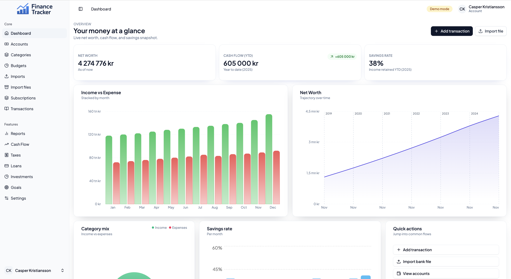
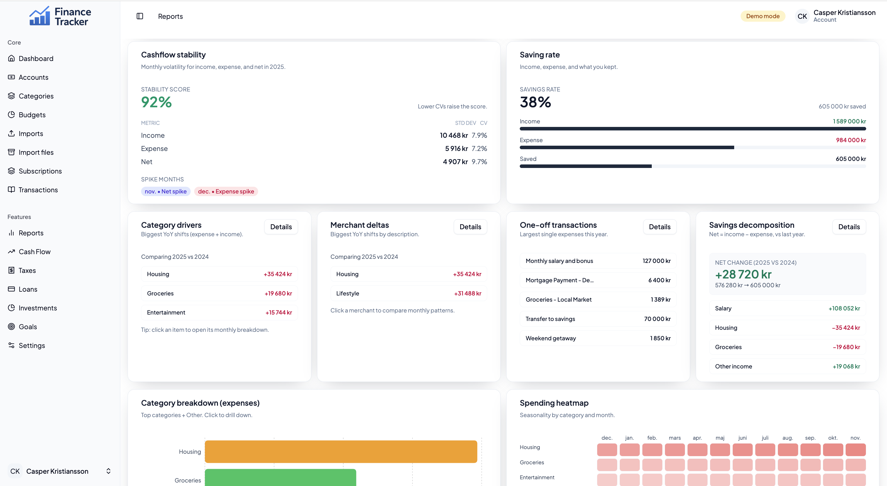
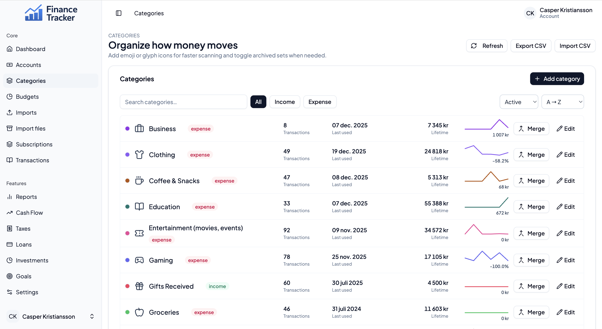
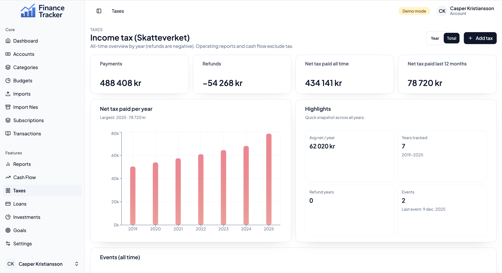
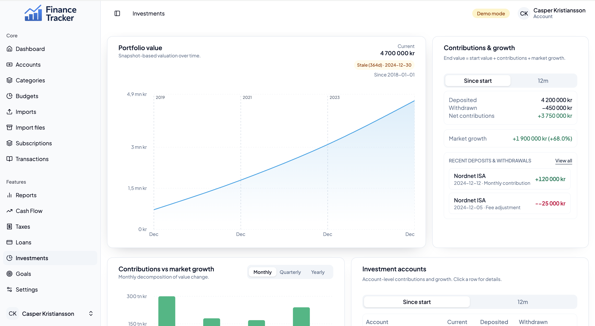
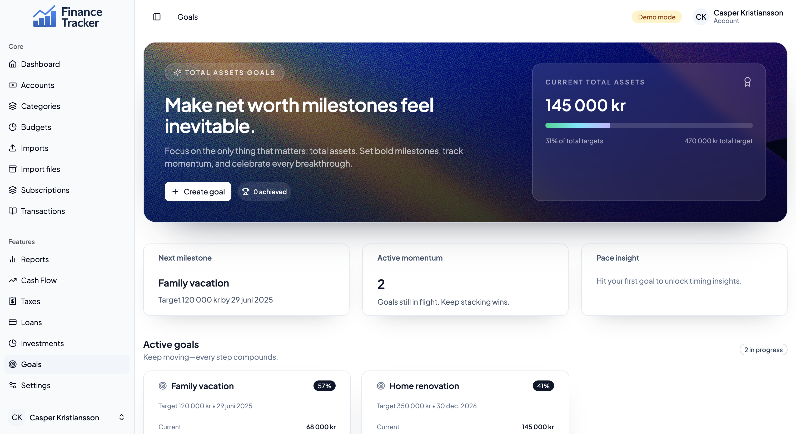
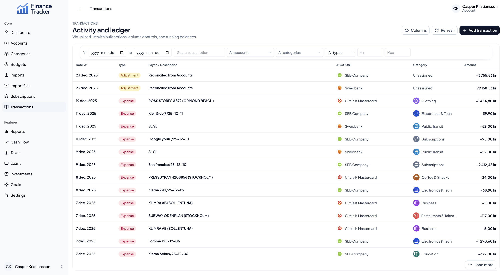

# Finance Tracker

Personal finance intelligence built as an end-to-end product: ingestion, categorization, reporting, and decision-ready insights. This repo is a full-stack showcase focused on UX polish, data-heavy views, and a clean service architecture.

<!-- IMAGE: Hero (replace with a wide dashboard screenshot) -->

## Product snapshot

- Unified view of transactions, accounts, budgets, goals, loans, investments, and taxes.
- Rich reporting with net-worth, cash-flow, and category analytics.
- Spreadsheet import workflows with preview, mapping, and reconciliation.
- UX-first interface with motion, progressive loading states, and data-dense layouts.

## Screenshots

<!-- IMAGE: Dashboard -->

The command center view focuses on "what moved" and "what matters next" with quick access to accounts, goals, and high-signal KPIs.

<!-- IMAGE: Reports -->

Reporting is built for long-range clarity: net-worth trends, cash-flow volatility, and category mix that make tradeoffs visible.

### Feature grid

The feature set goes wide without feeling fragmented: each surface is scoped, data-dense, and tuned for daily use.

<table>
  <tr>
    <td></td>
    <td></td>
  </tr>
  <tr>
    <td></td>
    <td></td>
  </tr>
</table>

Day-to-day workflows stay close to the data, so editing, categorizing, and reconciling never feels like a separate mode.

<!-- IMAGE: Transactions -->

Imports and transactions emphasize speed: bulk ingest, smart mapping, and fast filters for audit-ready edits.

## Why this project

I wanted a personal finance workspace that felt like a modern product instead of a spreadsheet. The goal is clarity: see where money goes, how it compounds, and what to do next. This repo is where I explore data modeling, UI density, and end-to-end product thinking.

It is built as a portfolio-grade app, not a tutorial. Every screen is meant to be opinionated, fast, and practical for day-to-day tracking while still surfacing long-term trends.

## Highlights

- Data-rich reporting (yearly and total views, net worth trajectory, category mix, cash-flow forecasts).
- Full CRUD flows across domains like accounts, budgets, loans, investments, and subscriptions.
- Authenticated experience with AWS Amplify and Cognito-ready configuration.
- Async data orchestration via Redux Toolkit + Saga for predictable client state.
- Import pipelines powered by pandas and openpyxl for real-world bank data.

## Feature deep dive

### Transactions & imports

Capture spending and income with a multi-leg transaction model that supports transfers and rich filtering. Imports accept spreadsheet exports with previews and validation, then commit into the ledger with running balances and reconciliation support.

### Categories & rules

Maintain a category system that scales: income vs expense types, icon and color metadata, archival, and merges. Categories surface lifetime totals and recent sparklines so the classification system becomes a real decision tool.

### Accounts & reconciliation

Track every account and balance, including debt accounts with embedded loan metadata. Reconciliation creates explicit adjustments with captured balances, reconciliation gaps, and timestamps so ledger state always aligns with reality.

### Budgets & subscriptions

Define budgets per category and time period, then track spent vs remaining with progress metrics. Subscription matching uses merchant text, tolerance, and day-of-month rules to attach recurring transactions and visualize spend trends.

### Debt & loans

Model loans with principal, interest, minimum payments, and expected maturity dates. Generate amortization schedules and derive loan events from transactions to visualize liability changes over time.

### Investments

Record investment snapshots, holdings, and cashflows, then roll them into portfolio and account-level overviews. Performance metrics include realized and unrealized gains, time-weighted and IRR values, and benchmark comparisons, plus raw statement parsing for broker exports.

### Goals

Set goals with target amounts and dates, optionally linked to accounts, categories, or subscriptions. Progress is computed from current balances so goals stay grounded in actual ledger data.

### Taxes

Record tax payments and refunds with authority metadata and notes, then generate monthly and yearly summaries. The tax dashboard highlights total paid, refunds, and the largest periods at a glance.

### Reporting & analytics

Yearly and total reports break down category mix, cash-flow volatility, net worth trajectory, and cash runway. Dedicated endpoints deliver exports, projections, and forecasts so the reporting layer can evolve without rewriting the UI.

### Security & session handling

Authentication is handled via AWS Amplify and Cognito-backed configuration with session-aware data loading. The app maintains a clean separation between authenticated and demo flows.

## Tech stack

**Frontend**

- React 19 + Vite 6 + TypeScript
- Tailwind CSS 4, Radix UI primitives, shadcn-style components, lucide icons
- Redux Toolkit + redux-saga, react-router, React Hook Form + Zod
- Recharts for visualization, Framer Motion for transitions

**Backend**

- Python 3.13, SQLModel + SQLAlchemy, Pydantic schemas
- Alembic migrations, pytest coverage
- Serverless-style AWS Lambda handlers (organized by feature)

**Infra**

- Terraform for infrastructure-as-code
- AWS integration points (Lambda, Cognito via Amplify)

## Repo layout

- `apps/web` - Vite + React frontend
- `apps/api` - Python API handlers, services, repositories, and schemas
- `infra/terraform` - Infrastructure definitions
- `docs` - Supporting documentation and assets
